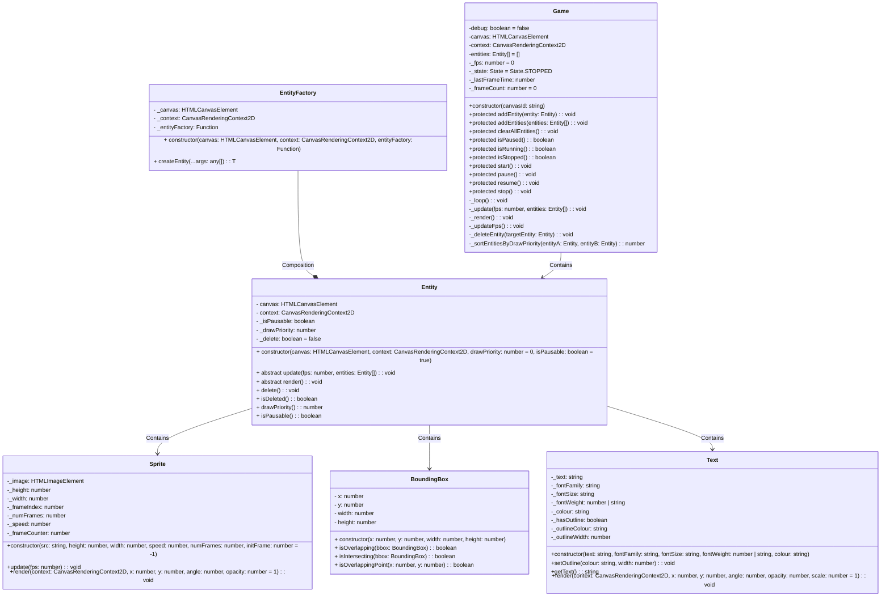

# BugTap Engine Docs

## Class Diagrams

The class diagrams illustrate the core components of a game engine designed for developing interactive web-based games. The diagrams depict relationships and interactions between classes such as `Entity`, `EntityFactory`, `Game`, `Sprite`, `BoundingBox`, and `Text`. These classes represent fundamental elements of game development, including game entities, collision detection, and rendering images or text. The relationships depicted in the diagrams showcase how these classes collaborate to create, manage, and render game elements within the engine.

