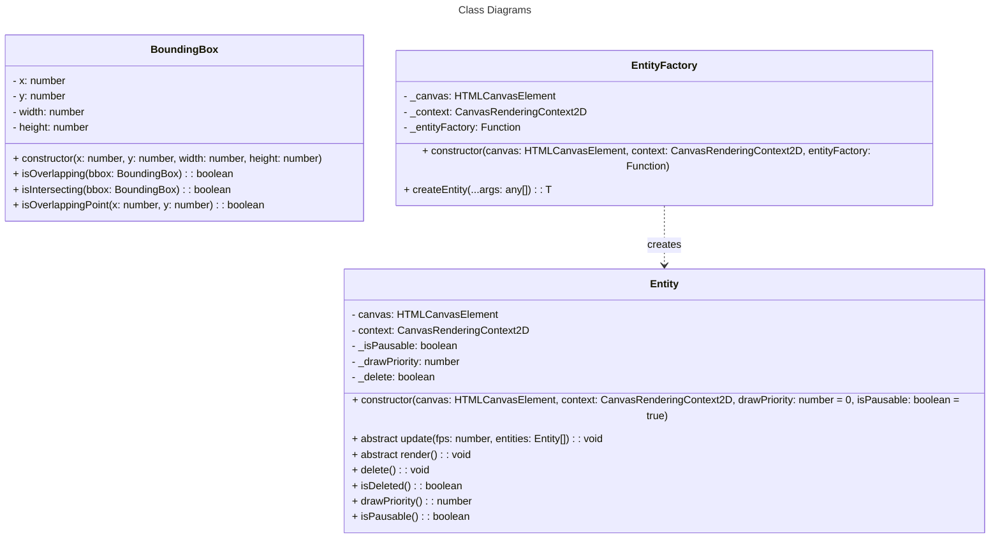

# BugTap Engine Docs

```mermaid
---
title: Class Diagrams
---
classDiagram
    class BoundingBox {
        - x: number
        - y: number
        - width: number
        - height: number
        + constructor(x: number, y: number, width: number, height: number)
        + isOverlapping(bbox: BoundingBox): boolean
        + isIntersecting(bbox: BoundingBox): boolean
        + isOverlappingPoint(x: number, y: number): boolean
    }

    class Entity {
        - canvas: HTMLCanvasElement
        - context: CanvasRenderingContext2D
        - _isPausable: boolean
        - _drawPriority: number
        - _delete: boolean
        + constructor(canvas: HTMLCanvasElement, context: CanvasRenderingContext2D, drawPriority: number = 0, isPausable: boolean = true)
        + abstract update(fps: number, entities: Entity[]): void
        + abstract render(): void
        + delete(): void
        + isDeleted(): boolean
        + drawPriority(): number
        + isPausable(): boolean
    }

    class EntityFactory {
        - _canvas: HTMLCanvasElement
        - _context: CanvasRenderingContext2D
        - _entityFactory: Function
        + constructor(canvas: HTMLCanvasElement, context: CanvasRenderingContext2D, entityFactory: Function)
        + createEntity(...args: any[]): T
    }

    EntityFactory ..> Entity : creates
```
