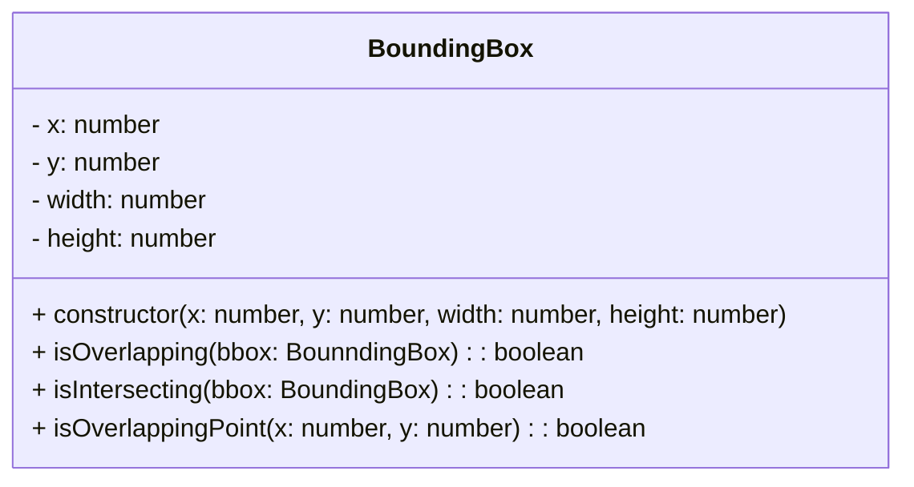

# BugTap Engine

## Overview

```mermaid
classDiagram
    class BoundingBox {
        - x: number
        - y: number
        - width: number
        - height: number
        + constructor(x: number, y: number, width: number, height: number)
        + isOverlapping(bbox: BounndingBox): boolean
        + isIntersecting(bbox: BoundingBox): boolean
        + isOverlappingPoint(x: number, y: number): boolean
    }
```
